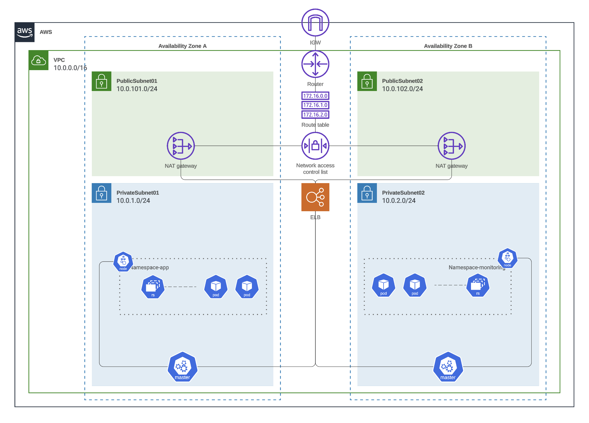

# Liatrio APP

This repository is responsible for provisioning an API hosted in an AWS EKS Cluster managed by Terraform and Packaged by Helm.

## Table of Contents

- [Terraform](./terraform/README.md)
- [API](./api/README.md)
- [Helm and Kubernetes](./charts/README.md)

## Development Cycle

For developing this application we are using Trunk based development. Expected flow should go like:

- Make feature branch from `main` branch.
- Add unit tests and linting to any API code changes
- Make a pull request to merge feature branch into `main` branch.
- Required at least 1 approval
- `Main` branch will deploy resources into Develop environment
- Create tag called `release-<version>` to deploy resources into Prod environment

### Pipeline notes

When deploying to dev the tag is always `latest`.

When deploying to prod we reuse the same image that was built in the develop build image step. The image is pulled down and tagged with the most current release tag.

When updating the prod helm chart you need to first push the API changes and tag the release so the image is built and make sure you update the [values-prod.yaml](./charts/values-prod.yaml) file in the `image.tag` section.

### Pipeline steps:

#### Feature Branch:

- api-check: Linting and Testing API in pipeline
- plan-terraform: Run `terraform plan` to see changes before merged to `main`

#### Main Branch:

- api-check: Linting and Testing API in pipeline
- plan-terraform: Run `terraform plan` to see changes before merged to `main`
- build-image: Builds and pushes image to ECR
- deploy-develop: Deploys Helm chart to EKS and Terraform resources.

#### Release Tag:

- tag-image-prod: Tags existing image with latest release tag - `release-<version>`
- deploy-prod: Deploys Helm chart to EKS and Terraform resources.

### Deploying changes to Shared Environment

All Shared environment changes are Terraform only and are released by the `shared-terraform` branch

### Fixing a breaking change

When working in Trunk Based Development and producing code that breaks the application, instead of rolling back like other processes have you do we will roll forward. Trunk has quick release cycles which enable us to quickly fix the bug and push out a new version of code that fixes the issue.

## High Level Diagram

